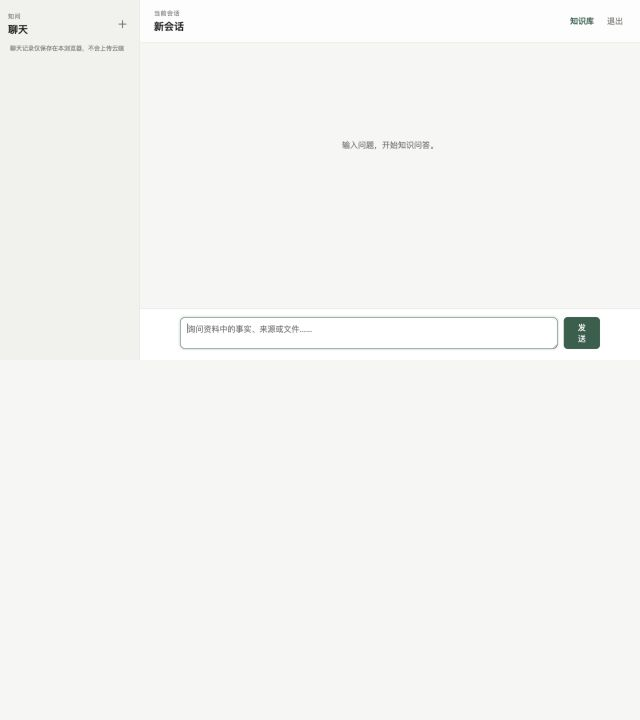
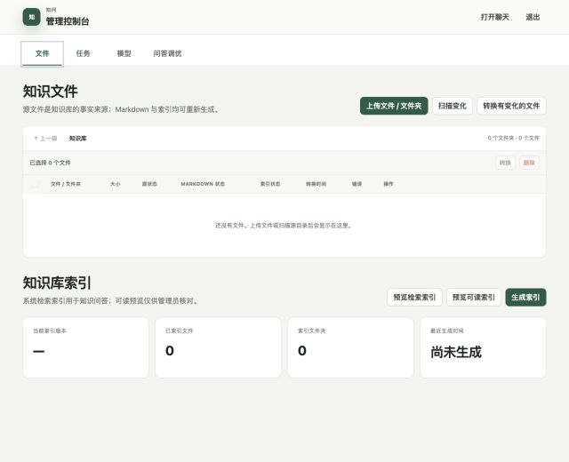
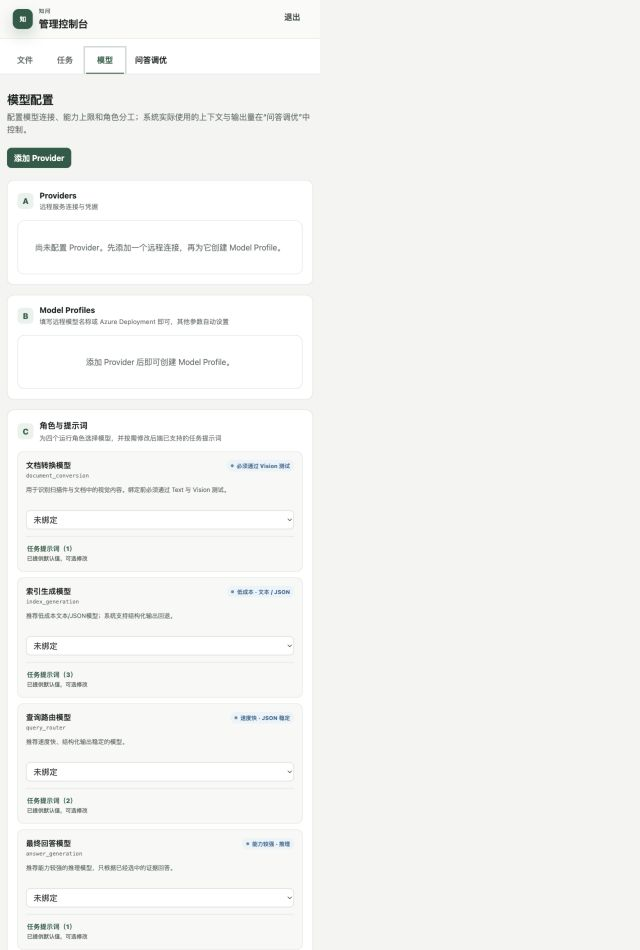
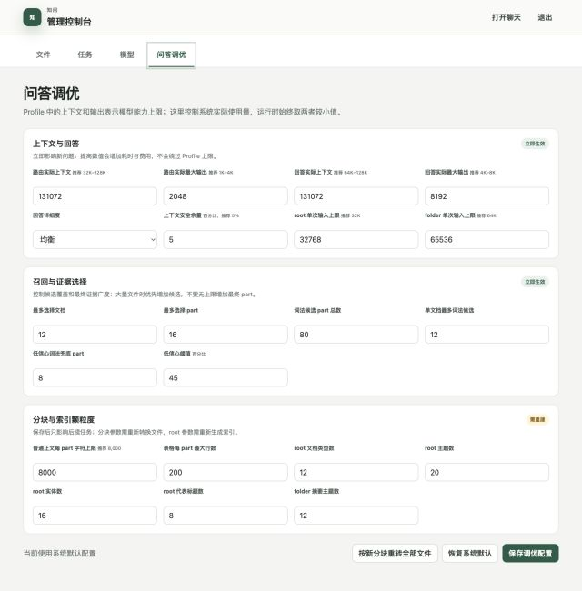
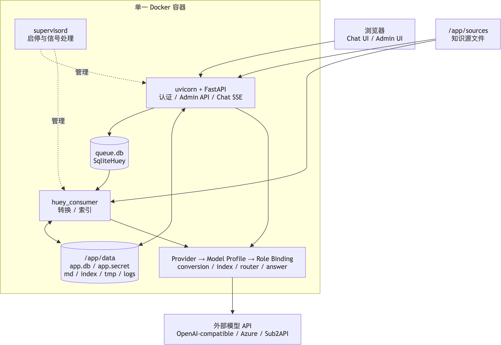

# 知问（mini-kb-agent）

> 不依赖 Embedding、向量数据库或 RAG 框架的轻量级本地知识问答系统。只需一个兼容 OpenAI 协议的多模态大模型 API，即可完成文档理解、层级索引、问题路由和基于证据的回答。


[Docker Hub：`saitomikuya/mini-kb-agent`](https://hub.docker.com/r/saitomikuya/mini-kb-agent)

`mini-kb-agent` 面向个人、小团队和内网场景：把 PDF、Word、PPT、Excel、图片等资料放进本地目录，系统会异步转换为 Markdown，生成可读的两级 JSON 索引，并在提问时让大模型只查看经过本地筛选和索引校验的证据。

它的“轻量”指的是部署和基础设施轻量：一个容器、两个持久化目录、一个模型 API，不需要额外部署 Milvus、Qdrant、Elasticsearch、Redis、PostgreSQL，也不依赖 LangChain 或 LlamaIndex。

## 目录

- [30 秒启动](#30-秒启动)
- [系统截图](#系统截图)
- [为什么轻量](#为什么轻量)
- [主要能力](#主要能力)
- [系统如何实现](#系统如何实现)
- [完整运行逻辑](#完整运行逻辑)
- [模型配置](#模型配置)
- [Docker Compose](#docker-compose)
- [本地开发](#本地开发)
- [目录结构](#目录结构)
- [配置与运维](#配置与运维)
- [安全与隐私](#安全与隐私)
- [已知限制](#已知限制)

## 30 秒启动

Docker 一键部署：

```bash
docker run -d \
  --name mini-kb-agent \
  -p 8080:8080 \
  -e CHAT_PASSWORD='please-change-chat-password' \
  -e ADMIN_PASSWORD='please-change-admin-password' \
  -e TZ='Asia/Shanghai' \
  -v mini-kb-sources:/app/sources \
  -v mini-kb-data:/app/data \
  --restart unless-stopped \
  saitomikuya/mini-kb-agent:latest
```

启动后访问：

- Chat：<http://localhost:8080>
- Admin：<http://localhost:8080/admin>
- 健康检查：<http://localhost:8080/health>

第一次使用时，在 Admin 中按以下顺序操作：

1. 添加一个 API Provider；
2. 添加一个支持文本与视觉的 Model Profile，并执行连接测试；
3. 将同一个 Profile 绑定到四个模型角色；
4. 上传资料，或把资料放入 `/app/sources` 后点击“扫描变化”；
5. 点击“转换有变化的文件”，完成后点击“生成索引”；
6. 打开 Chat 提问。

最小配置只需要一个多模态模型 API。需要进一步控制成本或效果时，可以把转换、索引、路由、回答四个角色分别绑定到不同模型。

## 系统截图

### Chat 知识问答



### 知识文件与索引管理



### Provider、Model Profile 与四个模型角色



### 问答参数与索引颗粒度调优



> 截图来自独立的空白演示实例，不包含真实知识文件、模型地址或 API Key。

## 为什么轻量

传统向量知识库常见的部署链路是：文档切块 → Embedding → 向量数据库 → 相似度召回 → RAG 编排 → 大模型回答。它通常还需要维护 Embedding 模型、向量库、索引参数和额外的中间服务。

知问使用的是另一条路径：

```text
源文件
  → Markdown
  → 文档卡片 JSON
  → folder/root 两级 JSON 索引
  → 本地 FTS/BM25 候选
  → 大模型在白名单内重排
  → 加载少量原文证据
  → 基于证据回答
```

因此它不需要：

- Embedding 模型与向量生成任务；
- Milvus、Qdrant、Pinecone、Weaviate 等向量数据库；
- LangChain、LlamaIndex 等 RAG 编排框架；
- Redis、Celery、Elasticsearch 或独立数据库服务；
- React/Vue/Node.js 前端构建链。

系统仍然会“选择证据并交给模型回答”，但检索权威是本地 JSON 层级索引和可再生成的词法索引，不是向量相似度。更准确地说，它不使用传统的 Embedding + Vector DB RAG 基础设施。

### 最小运行依赖

| 依赖 | 用途 |
| --- | --- |
| Docker | 运行单个应用容器 |
| 一个多模态大模型 API | 文档视觉理解、索引、路由与回答 |
| `/app/sources` | 保存原始知识文件 |
| `/app/data` | 保存 SQLite、Markdown 和索引 |

Web、后台 Worker、任务队列和数据库都在同一个容器中。默认只运行一个 Worker，适合个人或小型单机场景。

## 主要能力

- 支持 PDF、DOC/DOCX、PPTX、XLSX、XLS、CSV、TSV、TXT、MD、HTML、JSON、XML、PNG、JPG/JPEG、WEBP；旧版 DOC 会先由镜像内置的 LibreOffice 转为 DOCX；
- 文本可直接提取时优先使用确定性解析，扫描页和复杂视觉内容才调用 Vision；
- Excel/CSV 数值由本地解析器读取，不让视觉模型重新猜测单元格；
- 源文件扫描、单文件上传、文件夹上传、下载、原子替换和路径越界保护；
- 增量转换与增量索引，只处理新增或内容变化的文件；
- Huey + SQLite 异步任务，支持暂停、继续、停止、重试、心跳和崩溃恢复；
- 两级 JSON 索引、文档卡片和本地 FTS/BM25 长尾召回；
- 严格引用校验、冲突值展示和真实源文件下载；
- OpenAI-compatible、Azure OpenAI v1/legacy、Sub2API；
- Responses API，并在真实失败后回退到 Chat Completions；
- Provider、Model Profile、Model Role Binding 三层配置；
- 四个模型角色可以共用一个模型，也可以分别使用不同供应商和模型；
- Chat 与 Admin 使用独立密码和独立权限；
- Chat 会话只保存在浏览器 IndexedDB，不写入服务端数据库；
- Jinja2 + Vanilla JavaScript，无前端构建步骤；
- 单容器运行，supervisord 同时管理 FastAPI Web 和 Huey Worker。

## 系统如何实现

### 总体架构



可编辑图源：[docs/assets/architecture.drawio](docs/assets/architecture.drawio)。

```text
Browser
  ├─ Chat UI  ────────┐
  └─ Admin UI ────────┤
                      ▼
                 FastAPI Web
            ┌─────────┼──────────┐
            │         │          │
         SQLite    JSON/MD    Huey queue
            │         │          │
            └─────────┴──────┬───┘
                              ▼
                         Huey Worker
                              │
                              ▼
                OpenAI-compatible model API
```

### 1. 源文件是唯一事实来源

`/app/sources` 中的文件是知识内容的唯一 source of truth。转换生成的 Markdown、文档卡片、层级索引和词法索引都属于可重新生成的派生物，只写入 `/app/data`。

扫描时先比较相对路径、大小和纳秒级 mtime；只有新增、重新出现或元数据变化的文件才流式计算 SHA-256。仅修改 mtime、内容哈希未变化时，不会触发重复转换。

### 2. 文档转换

转换任务不在 HTTP 请求中执行，而是写入 SQLite 业务任务表，再由 Huey Worker 异步处理。

转换策略：

- PDF/Office/文本文件优先使用 MarkItDown 和本地解析器；
- 低文本密度页面、扫描件和嵌入图片使用 `document_conversion` 角色的 Vision 能力；
- 表格使用 openpyxl、xlrd 或 CSV reader 确定性提取；
- 长文档按正文字符或表格行数拆成多个 Markdown part；
- 完整 artifact 先写入 `/app/data/tmp/<job>/<document>/`，校验并 fsync 后再原子替换正式目录；
- 失败不会发布半成品，上一份成功 artifact 会继续保留。

每个文档的产物大致如下：

```text
/app/data/md/<document_id>/
  manifest.json
  part-001.md
  part-002.md
  ...
  card.json
  card.meta.json
```

### 3. 层级 JSON 索引

索引生成不把所有正文塞进一个大文件，而是构建两级目录：

```text
root.json
  └─ folder summary
       └─ document card
            └─ Markdown part
```

- `card.json` 描述单个文档的标题、类型、主题、实体、时间、摘要和 part；
- folder JSON 汇总当前文件夹内的文档卡片；
- root JSON 汇总各 folder 的类型、主题、实体和代表文档；
- JSON 是机器检索的唯一权威格式；
- Markdown 索引只是 Admin 可读预览，不参与运行时选择。

索引在一个新的 generation 目录内完整生成。只有 JSON、文档卡片和词法索引的 ID 集合全部校验一致后，系统才原子切换 `index/current.json`。中途失败不会破坏当前可用索引。

### 4. 本地词法候选

每个索引 generation 内会生成一个可再生成的 `lexical.sqlite3`，使用 SQLite FTS/BM25 索引：

- 文件路径和标题；
- 文档类型、主题和实体；
- 文档/part 摘要；
- Markdown 正文词项；
- 编号、日期和数值等精确长尾信息。

词法索引只负责产生候选。候选文档和 part 仍必须通过 root/folder/card JSON 白名单，不能绕过层级索引直接把任意正文交给模型。

### 5. 模型路由与上下文预算

收到问题后，`query_router` 先在本地候选中重排文档和 part。没有可靠词法候选时，系统回退到 root → folder 的两阶段导航。

运行时会同时考虑：

- Model Profile 声明的最大 context window；
- Admin“问答调优”中的实际上下文目标；
- root/folder 单次输入上限；
- 安全余量；
- 最多文档数、最多 part 数和低信心兜底数量。

最终取 Profile 能力上限和调优目标中的较小值，不会因为配置写得过大而越过模型上限。

### 6. 基于证据回答

`answer_generation` 只收到已选 Markdown 和有限元数据，不会看到整个知识库。模型返回结构化回答后，后端再次校验：

- citation 的 document id 是否存在；
- part id 是否属于该文档；
- anchor、label 是否来自已加载证据；
- download id 是否指向 source root 边界内的真实文件；
- 冲突项是否保留了所有有效值。

如果两个来源对同一事项给出不同数值，系统展示全部冲突值，不做平均，也不默选一个值。知识库缺少事实时，回答不会用模型常识补齐；若只缺公开参数，可生成一段供联网大模型继续查询的交接提示词。

### 7. 任务持久化与恢复

Huey 只负责调度，真实进度保存在主 SQLite 的 `jobs` 与 `job_items` 表中。任务 payload 只携带稳定 job id，因此 Worker 重启、重复投递或超时恢复时：

- 不会创建一个新的替代任务；
- 已完成 item 不会重复执行；
- 运行中失联任务会按 heartbeat 超时接管，Worker 进程重启时还会立即对账所有未完成任务；
- 暂停、继续、停止和重试都有持久化状态，耗时会排除暂停和停止等待时间。

## 完整运行逻辑

### 入库链路

```text
上传文件 / 挂载目录
  → 扫描路径和文件元数据
  → 对变化项计算 SHA-256
  → 创建 conversion job
  → Worker 转 Markdown/表格/视觉内容
  → 分 part、生成 manifest
  → 原子发布 Markdown artifact
  → 创建 index job
  → 为变化文档生成 card.json
  → 增量重建受影响 folder
  → 重建 root 与 lexical.sqlite3
  → 校验完整 generation
  → 原子激活新索引
```

### 问答链路

```text
当前问题 + 当前会话近期上下文
  → 识别问答/下载意图
  → FTS/BM25 召回候选 part
  → JSON/card 白名单校验
  → query_router 重排候选
  → 低信心时补入本地候选
  → 按 token budget 加载 Markdown 证据
  → answer_generation 生成结构化回答
  → 后端验证引用、冲突和下载
  → SSE 流式返回阶段、回答与来源
  → 浏览器将会话保存到 IndexedDB
```

### 增量更新

修改一个已入库文件后：

1. “扫描变化”只把哈希变化的文件标为 `CHANGED`；
2. “转换有变化的文件”只创建该文件的 job item；
3. “生成索引”只重新生成该文档卡片和受影响 folder；
4. 未变化 folder 的字节内容直接复用；
5. 新 generation 校验通过后一次性切换。

## 模型配置

### 三层模型抽象

```text
API Provider
  → Model Profile
      → Model Role Binding
```

- **Provider**：API 地址、认证、协议类型和额外 header；
- **Model Profile**：远程模型/deployment 名、context/output 上限和连接测试结果；
- **Role Binding**：指定某个业务角色使用哪个 Profile。

Provider 不等于模型，模型也不等于角色。一个 Provider 可以创建多个 Profile，同一个 Profile 可以绑定多个角色。

### 四个模型角色

| Role | 用途 | 最低能力 |
| --- | --- | --- |
| `document_conversion` | 识别扫描页、图片和 Office 视觉内容 | Text + Vision |
| `index_generation` | 生成文档卡片和摘要 | Text，支持 JSON 回退 |
| `query_router` | root/folder/文档/part 选择 | Text + 可靠 JSON |
| `answer_generation` | 只基于选中证据回答 | Text |

最简单的配置方式：创建一个支持 Text、Vision 和可靠 JSON 的多模态 Profile，然后把四个角色全部绑定到它。

更经济的配置方式：

```text
document_conversion → 便宜的多模态模型
index_generation    → 便宜的文本/JSON 模型
query_router        → 快速、JSON 稳定的模型
answer_generation   → 能力更强的回答模型
```

每个角色都有可编辑的任务提示词和独立的推理强度。系统提供默认值：文档转换与索引生成使用 `low`，查询路由与最终回答跟随模型默认；只有管理员显式保存后才覆盖默认提示词。

### 支持的 Provider

- `openai_compatible`：OpenAI 或兼容 OpenAI API 的网关；
- `azure_openai`：Azure OpenAI v1 或 legacy deployment API；
- `sub2api`：独立 Provider 类型，复用 OpenAI 协议核心。

API Key 使用从 `/app/data/app.secret` 派生的 Fernet key 加密；Admin API 只返回掩码，不会把明文 Key 返回到前端。

## Docker Compose

仓库已提供 [docker-compose.yml](docker-compose.yml) 和 [.env.example](.env.example)。

```bash
cp .env.example .env
```

修改 `.env` 中的 Chat/Admin 密码，然后运行：

```bash
docker compose up -d
```

不创建 `.env` 也可以一条命令启动：

```bash
CHAT_PASSWORD='please-change-chat-password' \
ADMIN_PASSWORD='please-change-admin-password' \
docker compose up -d
```

完整 Compose 配置：

```yaml
services:
  mini-kb-agent:
    image: ${MINI_KB_IMAGE:-saitomikuya/mini-kb-agent:latest}
    container_name: ${CONTAINER_NAME:-mini-kb-agent}
    ports:
      - "${APP_PORT:-8080}:8080"
    environment:
      CHAT_PASSWORD: ${CHAT_PASSWORD:?请设置 CHAT_PASSWORD}
      ADMIN_PASSWORD: ${ADMIN_PASSWORD:?请设置 ADMIN_PASSWORD}
      TZ: ${TZ:-Asia/Shanghai}
      SESSION_MAX_AGE: ${SESSION_MAX_AGE:-604800}
    volumes:
      - mini-kb-sources:/app/sources
      - mini-kb-data:/app/data
    restart: unless-stopped

volumes:
  mini-kb-sources:
  mini-kb-data:
```

常用命令：

```bash
docker compose ps
docker compose logs -f
docker compose pull
docker compose up -d
docker compose down
```

`docker compose down` 不会删除两个命名 volume。不要随意添加 `-v`，否则会删除持久化数据。

### 域名与 HTTPS 反向代理

容器会接受来自任意反向代理地址的 `X-Forwarded-Proto`、`X-Forwarded-For` 和 `X-Forwarded-Host`，因此 Nginx、Caddy、Traefik 位于 Docker 网桥或另一台主机时无需额外加入 IP 白名单。前端静态资源使用同源路径，不会因 HTTPS 入口转发到 HTTP 容器而触发 Mixed Content 空白页。

反向代理至少应保留原始 Host，并传递协议：

```nginx
proxy_set_header Host $host;
proxy_set_header X-Forwarded-Proto $scheme;
proxy_set_header X-Forwarded-For $proxy_add_x_forwarded_for;
```

当前部署不使用客户端 IP 做权限判断；访问控制由 Chat/Admin 密码完成。如果把 8080 端口直接暴露到公网，仍应使用防火墙限制直连，仅开放 HTTPS 反代入口。

### 使用宿主机目录

如果希望直接管理源文件，可以把 Compose 中的 volume 改为 bind mount：

```yaml
volumes:
  - /absolute/path/to/knowledge:/app/sources
  - /absolute/path/to/data:/app/data
```

Windows Docker Desktop 示例：

```yaml
volumes:
  - C:/Knowledge:/app/sources
  - C:/mini-kb-data:/app/data
```

## 本地开发

需要 Python 3.12：

```bash
python3.12 -m venv .venv
. .venv/bin/activate
python -m pip install -e '.[test]'

export DATA_DIR="$PWD/data"
export SOURCE_DIR="$PWD/sources"
export CHAT_PASSWORD='change-me-chat'
export ADMIN_PASSWORD='change-me-admin'

alembic upgrade head
```

启动 Web：

```bash
python -m uvicorn app.main:app --host 0.0.0.0 --port 8080
```

另开一个终端启动 Worker：

```bash
huey_consumer.py app.tasks.consumer.huey -w 1 -k thread
```

运行测试：

```bash
pytest
python -m compileall -q app migrations tests
alembic check
python -m pip check
```

当前测试集包含 157 个测试，覆盖认证、数据库、模型客户端、文件管理、转换、后台任务、增量索引、导航、回答生成、Admin UI 和生产打包。

### 本地构建镜像

```bash
docker build -t mini-kb-agent:local .

CHAT_PASSWORD='change-me-chat' \
ADMIN_PASSWORD='change-me-admin' \
MINI_KB_IMAGE='mini-kb-agent:local' \
docker compose up -d
```

## 目录结构

```text
mini-kb-agent/
├── app/
│   ├── llm/             # Provider adapter、模型注册表、任务提示词
│   ├── models/          # SQLAlchemy 模型
│   ├── routers/         # FastAPI 路由
│   ├── schemas/         # Pydantic 输入/输出结构
│   ├── services/        # 转换、索引、导航、回答等业务编排
│   ├── static/          # Vanilla JS、CSS 和静态资源
│   ├── tasks/           # Huey 队列与 Worker 入口
│   ├── templates/       # Jinja2 Chat/Admin 页面
│   ├── config.py        # 环境变量配置边界
│   ├── db.py            # SQLite/SQLAlchemy 初始化
│   └── main.py          # FastAPI 应用入口
├── migrations/          # Alembic 数据库迁移
├── prompts/             # 版本化提示词资源
├── docs/                # 架构、决策、交接记录与截图
├── tests/               # pytest 测试
├── Dockerfile
├── docker-compose.yml
├── entrypoint.sh
└── supervisord.conf
```

容器内持久化布局：

```text
/app/sources/            # 原始知识文件
/app/data/
  app.db                 # 业务数据库
  queue.db               # Huey 队列
  app.secret             # Cookie/API Key 加密根密钥
  md/                    # Markdown 与文档卡片
  index/                 # root/folder JSON 与 lexical.sqlite3
  tmp/                   # 原子发布前的临时产物
  logs/                  # 运行日志
```

## 配置与运维

### 主要环境变量

| 变量 | 默认值 | 说明 |
| --- | --- | --- |
| `CHAT_PASSWORD` | 空 | Chat 登录密码；空值无法登录 |
| `ADMIN_PASSWORD` | 空 | Admin 登录密码；空值无法登录 |
| `DATA_DIR` | `/app/data` | 数据库、队列、密钥和派生物目录 |
| `SOURCE_DIR` | `/app/sources` | 原始知识文件目录 |
| `SOURCE_DISPLAY_ROOT` | 空 | 仅用于 UI 显示宿主机路径，不参与 I/O |
| `TZ` | `UTC` | 容器时区 |
| `SESSION_MAX_AGE` | `604800` | 登录会话有效期，秒 |
| `JOB_HEARTBEAT_TIMEOUT` | `60` | RUNNING 任务过期判断，秒 |
| `QUERY_ROUTER_CONTEXT_TOKENS` | `131072` | 路由实际上下文目标 |
| `ANSWER_CONTEXT_TOKENS` | `131072` | 回答实际上下文目标 |
| `ANSWER_MAX_OUTPUT_TOKENS` | `8192` | 回答实际输出目标 |
| `ANSWER_VERBOSITY` | `medium` | `low` / `medium` / `high` |
| `LEXICAL_CANDIDATE_PARTS` | `80` | 交给 router 重排的本地候选数 |
| `LEXICAL_FALLBACK_PARTS` | `8` | 低信心时补入的候选数 |
| `DOCUMENT_TEXT_CHARS_PER_PART` | `8000` | 普通正文分片字符上限 |
| `DOCUMENT_EXCEL_ROWS_PER_PART` | `200` | 表格分片最大行数 |

问答效果类参数也可以在 Admin“问答调优”中修改。数据库保存值优先于环境变量；“恢复系统默认”会重新使用环境变量或内置值。

### 健康检查

镜像内置 Docker `HEALTHCHECK`，请求：

```text
GET http://127.0.0.1:8080/health
```

查看状态：

```bash
docker inspect --format '{{json .State.Health}}' mini-kb-agent
docker logs -f mini-kb-agent
```

健康检查只验证 Web HTTP 存活，不会调用模型 Provider，也不是 Worker 的端到端诊断。

### 备份与恢复

建议停容器后同时备份 sources 和 data：

```bash
docker stop mini-kb-agent
docker run --rm \
  -v mini-kb-sources:/sources:ro \
  -v mini-kb-data:/data:ro \
  -v "$PWD":/backup \
  alpine tar -czf /backup/mini-kb-agent-backup.tgz /sources /data
docker start mini-kb-agent
```

必须备份 `app.secret`。丢失它会导致已保存的 Provider API Key 无法解密，已有签名 Cookie 也会失效。

恢复完整 data 目录后，entrypoint 会执行必要的 Alembic 升级，不会删除或重建已有 `app.db`。

### 升级镜像

```bash
docker compose pull
docker compose up -d
docker compose logs -f
```

升级前建议先备份两个 volume。

## 安全与隐私

- Chat 和 Admin Cookie 权限分离；Admin 可以进入 Chat，Chat 不能访问 Admin API；
- Provider API Key 加密保存在 SQLite，API 返回值始终掩码；
- 源文件下载只接受数据库 document id，并重新验证真实路径；
- `../`、绝对路径和越界 symlink 会被拒绝；
- Chat 问题、回答、处理事件和会话标题只持久化在当前浏览器 IndexedDB；后续提问会把当前会话最近 12 条、总计最多 4.8 万字符的上下文随请求发送给已配置模型；
- 服务端问答接口无会话状态，单次请求完成后不保存聊天内容或会话上下文；
- 官方镜像不包含本项目开发时使用的测试知识库、数据库、API Key 或运行日志；
- 请只挂载专用的 sources/data 目录，不要把整个主目录映射进容器。

## 常见问题

### 只配一个大模型可以吗？

可以。只要该 Profile 通过 Text、Vision 和可靠 JSON 测试，就能同时绑定四个角色。拆分模型只是成本、速度和效果优化，不是运行前提。

### 这是 RAG 吗？

它会选择证据并基于证据回答，但不使用 Embedding、向量相似度、向量数据库或 RAG 框架。检索由层级 JSON、文档卡片和本地 FTS/BM25 完成，因此不需要传统向量 RAG 的基础设施。

### 为什么回答“未找到”？

确认文件状态为 `PRESENT / READY / INDEXED`，并确认当前索引已包含该文件。系统不会用模型常识补齐知识库中不存在的事实。

### 为什么转换模型无法绑定？

`document_conversion` 必须通过 Text 与内置图片 Vision 测试。仅文本模型仍可用于另外三个角色。

### Responses API 不可用怎么办？

Provider 协议设为 `auto` 时，适配器会先真实请求 Responses，失败后再尝试 Chat Completions；也可以在 Provider/Profile 中显式指定协议。

### 任务重启后仍显示 RUNNING？

Worker 每次启动都会清理旧 `RUNNING` 租约并重新投递所有活动中的未完成任务，不需要先等待 heartbeat 超时。暂停和停止中的任务只规范化状态，不会自动执行；点击继续或重启后会从未完成 item 接着处理，已完成 item 不会重做。

### Docker 显示 unhealthy？

先查看 `docker logs mini-kb-agent`，再手工请求 `http://localhost:8080/health`。常见原因包括端口冲突、volume 权限或数据库迁移失败。

## 已知限制

- 定位为个人/小团队单机知识库，不支持水平扩展和多租户；
- Worker 默认并发为 1，以限制 SQLite 和文件系统争用；
- 容器内进程以 root 运行，以兼容常见 bind mount 权限；
- 不支持音频和视频转换；
- 扫描件、复杂 PDF/PPTX/DOCX 的质量取决于本地可提取内容和多模态模型能力；
- 转换、索引、导航和回答都需要可用的外部模型 API；
- 浏览器 IndexedDB 中的聊天不会跨设备同步，清除站点数据会清除本地会话；
- 为获得 SQLite 与文件 artifact 的一致备份，建议备份前短暂停止容器。

## 更多设计文档

- [架构契约](docs/ARCHITECTURE.md)
- [设计决策](docs/DECISIONS.md)
- [实现状态](docs/STATUS.md)
- [最终验收记录](docs/handoff/12-final.md)
